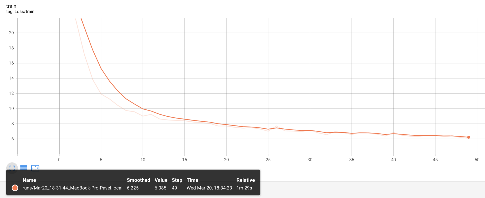
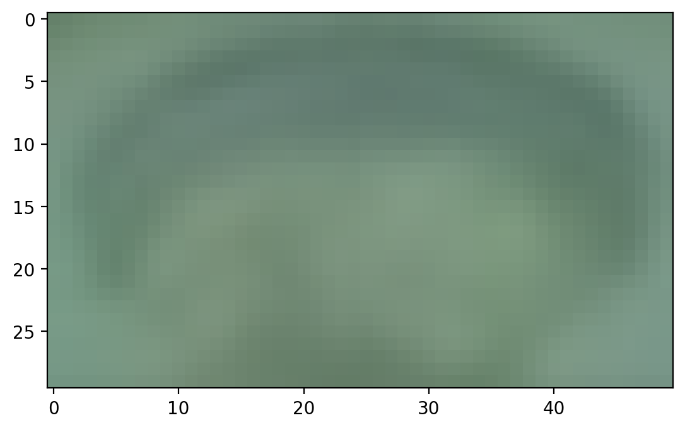

# itmo_gan_course

В этой ветке содержится решение 1-ого ДЗ по Глубоким Генеративным моделям. Данное ДЗ состоит из двух частей - генерация случайного стиля с использованием Байесовкой вероятности и MLE + генерация аватара на основне пикселей других аватаров, а также использование автоэнкодера для детекции аномалий.

Все использованные библиотеки указаны в `requirements.txt`

Author: Вязников Павел Андреевич

## MLE + Bayes для стилей и изображений

Файл part1.ipynb содержит исходный код решения этой части ДЗ с комментариями. Для генерации всех возможных стилей и подсчета их вероятности использована рекуррентная функция generate_bayes_dist. Для выбора случайного стиля с учетом вероятностей используется функция `np.random.choice`. Пример стиля и его вероятности - `('короткая прямые, серебристо серый, нет очков, комбинезон, синий',
 0.0007745453418843139)`.

Для генерации аватаров использованы изображения из основного репозитория курса. После подсчета вероятностей для каждого пикселя каждого канала происходит генерация 5 новых аватаров, примеры которых в папке `avatars_gen`. Из-за высокого разрешения исходных изображений, получаемые аватары очень похожи, сохраняя общий стиль, но отличаясь в отдельных пикселях.


## Автоэнкодер для детекции аномалий

Файл part2.ipynb содержит исходный код решения этой части ДЗ с комментариями. Задача заключается в детекции аномалий на изображениях лунок, в которые заливается металл для отливки изделий. В качестве решения был выбран обыкновенный автоэнкодер, который обучался минимизировать MSE со следующими параметрами:
- epoch = 50
- latent_dims = 256
- lr = 0.001
- batch_size = 64
- img_size = (30, 50)

После обучения средний loss на одно изображение составил ~5.5, а измеренный на изображениях с проливами - 20, с минимальным значением в ~10. 


<br/><br/>
<em>График значений loss во время обучения</em>
<br/><br/>



<br/><br/>
<em>Визуализация работы автоэнкодера при подаче положительных изображений (без пролива)</em>
<br/><br/>


Экспериментальным путем был подобран threshold (порог) = 12, при котором на тестовых данных модель выдает TPR и TNR = ~83%. Далее представлены значения MSE, которые получаются при подаче отриацательных изображений (с проливом).

```
loss for negative sample 1: 19.744293212890625
loss for negative sample 2: 22.14520263671875
loss for negative sample 3: 18.16210174560547
loss for negative sample 4: 19.1495304107666
loss for negative sample 5: 35.30286407470703
loss for negative sample 6: 19.652511596679688
loss for negative sample 7: 15.875557899475098
loss for negative sample 8: 15.68686294555664
loss for negative sample 9: 18.968942642211914
loss for negative sample 10: 12.721654891967773
loss for negative sample 11: 40.552734375
loss for negative sample 12: 21.443111419677734
loss for negative sample 13: 22.695350646972656
loss for negative sample 14: 15.401663780212402
loss for negative sample 15: 26.621822357177734
...
```

## Выводы

В данной работе были решены две задачи по генерации стилей и изображений, используя разные подходы:

1) В первой задаче для генерации случайных стилей и аваторв на основе примеров был использован подход Байесовкой вероятности, т.е. получаемые стили (или пиксели аватара) никак не учитывают друг друга, соответственно получаемые аватары содержат приблизительную аппроксимацию всех остальных аватаров, не слишком сильно меняясь при разных запусках (с поправкой на рандомный выбор пикселей в местах, где в примерах их много и они разнообразные), т.е. такой способ генераций изображений концептуально неверный (из-за огромной взаимосвязи пикселей друг с другом на реальных изображениях);
2) Во второй задаче был применен автоэнкодер для восстановления изображения вылитого цилиндра с целью детекции аномалий (модель не сможет качественно восстановить цилинрд из изображения с дефектом). Полученные результаты (~83% TPR и TNR) весьма высоки, и можно сделать вывод, что в условиях ограниченного объема данных, данный метод эффективен для детекции аномалий