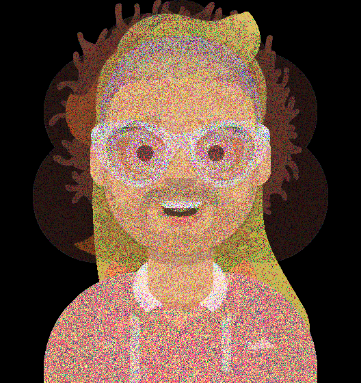

# itmo_gan_course

В этой ветке содержится решение 1-ого ДЗ по Глубоким Генеративным моделям. Данное ДЗ состоит из двух частей - генерация случайного стиля с использованием Байесовкой вероятности и MLE + генерация аватара на основне пикселей других аватаров, а также использование автоэнкодера для детекции аномалий.

Все использованные библиотеки указаны в `requirements.txt`

Author: Вязников Павел Андреевич

## MLE + Bayes для стилей и изображений

Файл part1.ipynb содержит исходный код решения этой части ДЗ с комментариями. Для генерации всех возможных стилей и подсчета их вероятности использована рекуррентная функция generate_bayes_dist. Для выбора случайного стиля с учетом вероятностей используется функция `np.random.choice`. Пример стиля и его вероятности - `('короткая прямые, серебристо серый, нет очков, комбинезон, синий',
 0.0007745453418843139)`.

Для генерации аватаров использованы изображения из основного репозитория курса. После подсчета вероятностей для каждого пикселя каждого канала происходит генерация 5 новых аватаров, примеры которых в папке `avatars_gen`. Из-за высокого разрешения исходных изображений, получаемые аватары очень похожи, сохраняя общий стиль, но отличаясь в отдельных пикселях.

## Автоэнкодер для детекции аномалий

Файл part2.ipynb содержит исходный код решения этой части ДЗ с комментариями. Задача заключается в детекции аномалий на изображениях лунок, в которые заливается металл для отливки изделий. В качестве решения был выбран обыкновенный автоэнкодер, который обучался минимизировать MSE со следующими параметрами:
- epoch = 50
- latent_dims = 256
- lr = 0.001
- batch_size = 64
- img_size = (30, 50)

После обучения средний loss на одно изображение составил ~5.5, а измеренный на изображениях с проливами - 20, с минимальным значением в ~10. Экспериментальным путем был подобран threshold (порог) = 12, при котором на тестовых данных модель выдает TPR и TNR = ~83%.