# itmo_gan_course

В этой ветке содержится решение 3-ого ДЗ по Глубоким Генеративным моделям. Задача заключается в проведении различных экспериментов над латентным пространством генеративной сети Stylegan2 (перенос стилей, замена лица и т.д.)

Все использованные библиотеки указаны в requirements.txt. Файл stylegan.ipynb содержит исходный код решения ДЗ с комментариями.

Author: Вязников Павел Андреевич

## Данные

В качестве набора изначальных данных выступает [сборник](https://www.kaggle.com/datasets/danupnelson/14-celebrity-faces-dataset) с лицами 14-ти известных актеров. Из этого датасета были выбраны 5 фотографий разных актеров с разными положениями головы. Используя LandmarksDetector на изображениях были найдены лица знаменитостей и перемещны в отдельную директорию. Далее приведены примеры фотографий актеров с разным положением головы:

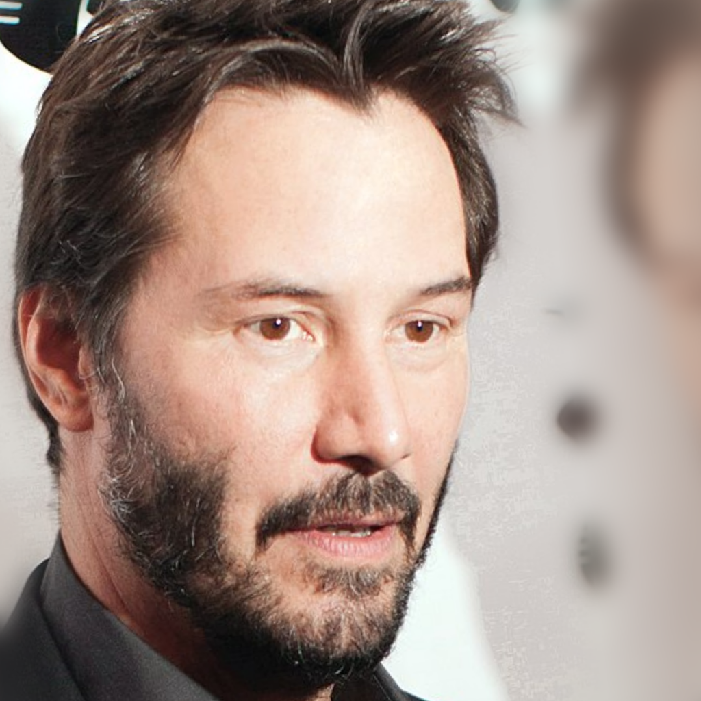

<em>Подготовленная фотография Киану Ривза</em>

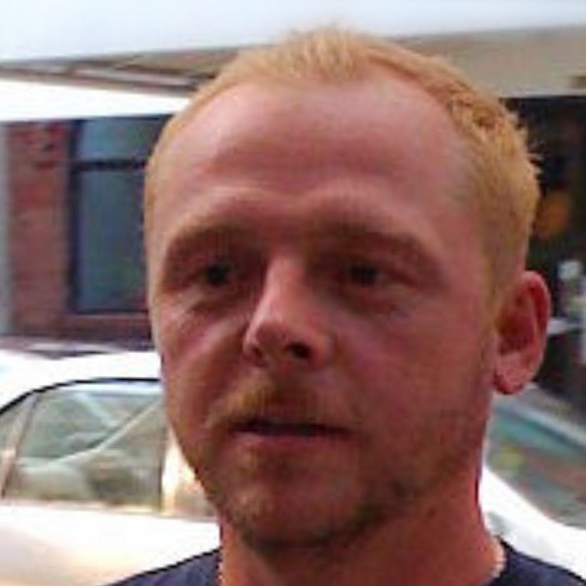

<em>Подготовленная фотография Симона Пегга</em>


## Отображение в латентном пространстве

После множества экспериментов было выявлено, что E4E энкодер значительно лучше позволяет отображать изображения в латентном простанстве StyleGAN, чем стандартная "оптимизация" вектора с шумом при помощи Lpips loss, Rec loss и Reg loss. Помимо этого, согласно экспериментам, "оптимизация" векторов, полученных из E4E, не всегда приводит к лучшему результату, зачастую упрощаяя изображения, теряя в деталях. Далее приведена таблица, в каждой строке которой приведен актер (актрисса), 1-ый столбец содержит оригинальное фото, 2-ой E4E вид, 3-ий - дополнительно оптимизированный E4E. Для оптимизиации использованы следующие параметры:
```
regularize_noise_weight = 5e2
rec_weight = 0.75
lpips_weight = 0.5

num_steps = 100
learning_rate = 0.01
```
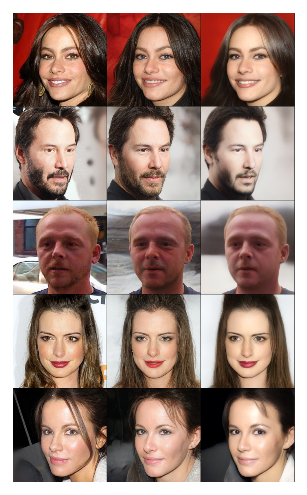

<em>Таблица с оригинальным фото в 1-ом столбце и его различными отображениями</em>


## Перенос стиля (Style transfer)

При помощи интерполяции векторов возможно перенести стиль из одного изображения в другое. Для данного эксперимента были выбраны и подготовлены 3 изображения, стиль которых будет скопирован на актеров, они представлены далее.

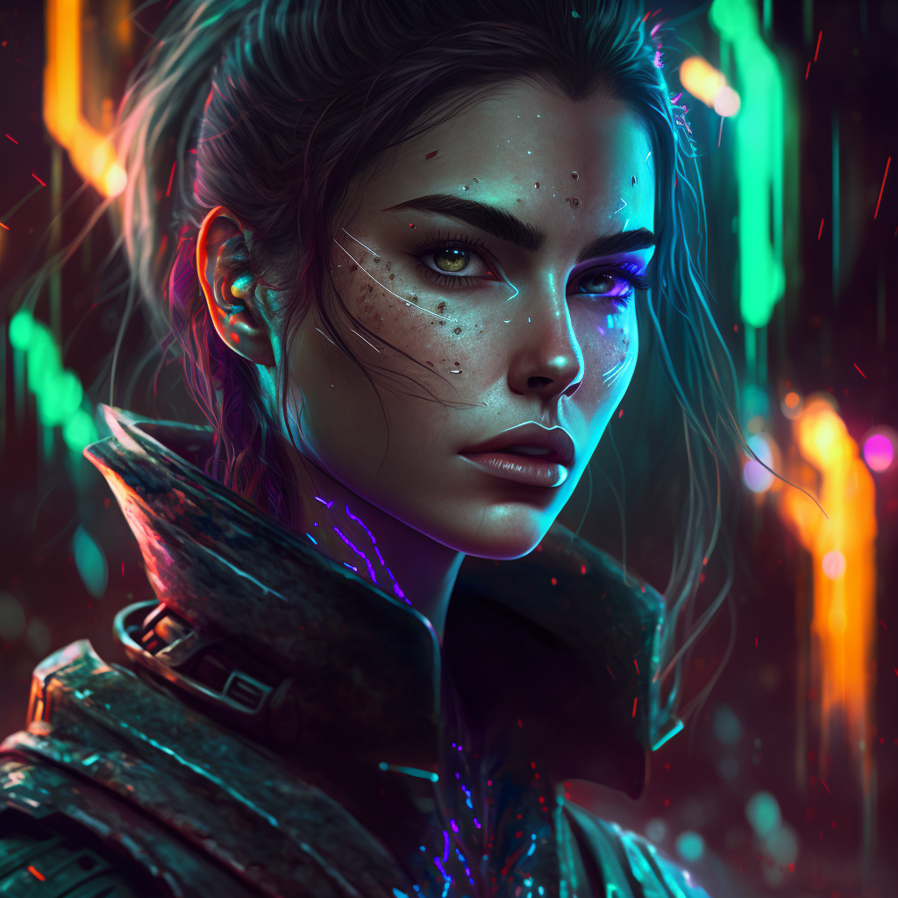

<em>Изображение в стиле киберпанк</em>

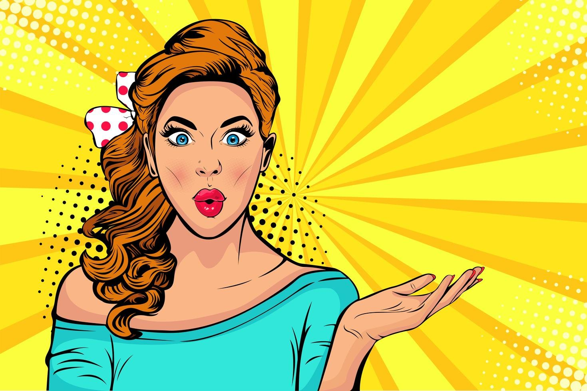

<em>Изображение в стиле поп</em>

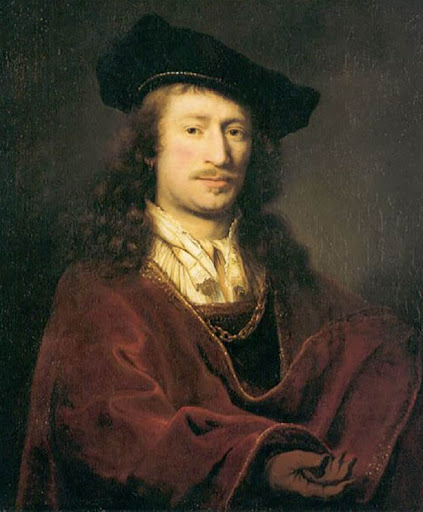

<em>Работа Вермеера</em>

Перенос стиля подразумевает сохранение черт лица, таких как мимика, положение глаз и т.д., т.е. изменению подлежит свет, окружение и т.п. Такого эффекта можно добиться, выбрав, например, элементы 8-18 латентных векторов изображений при интерполяции, и коэффициент psi=0.0. Полученные изображения представлены далее в табличном формате, результат переноса крайне выделяется.

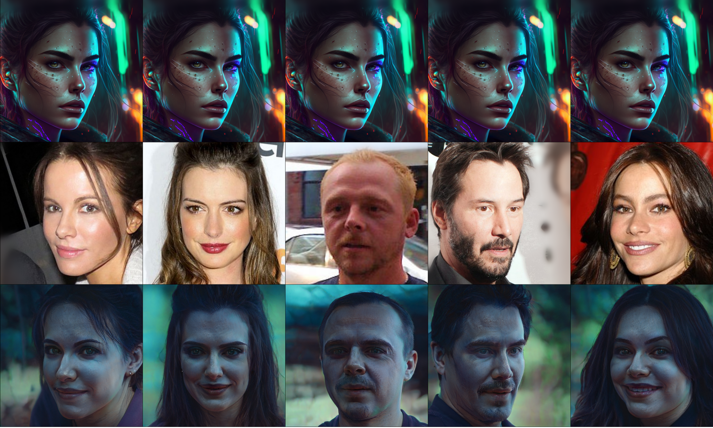

<em>Перенос стиля в киберпанк</em>


<em>Перенос стиля в поп</em>

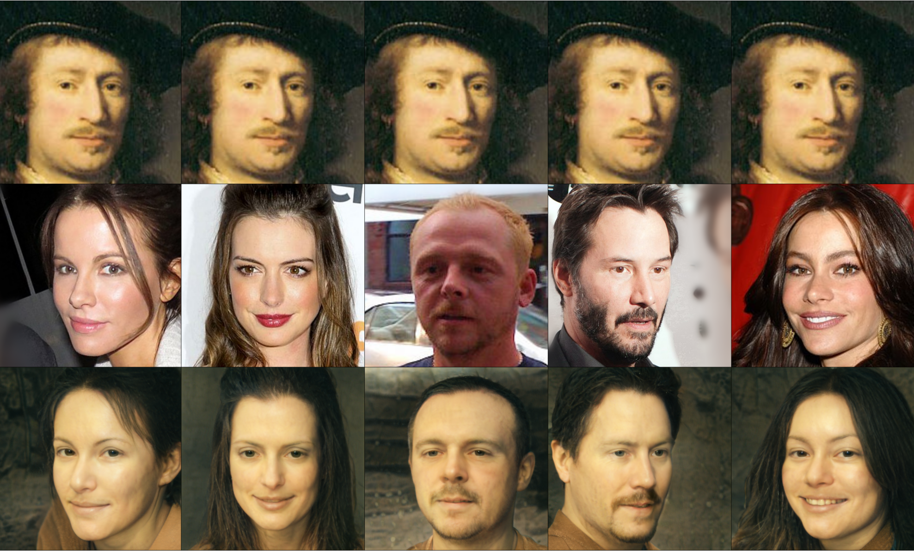

<em>Использование стиля Вермеера</em>


## Перенос мимики (Expression Transfer)

Перенос мимики фактически совпадает с переносом стиля за исключением иных параметров при интерполяции. Для данного эксперимента также были выбраны и подготовлены 3 фото людей, мимика которых будет скопирован на актеров, они представлены далее.

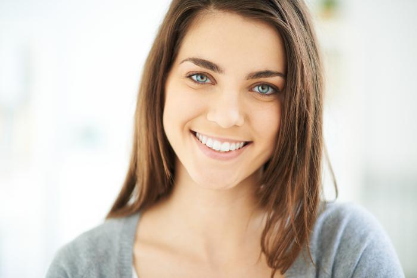

<em>Изображение улыбающейся девушки</em>

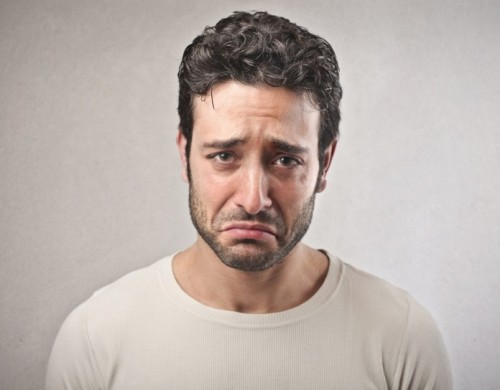

<em>Изображение грустного мужчины</em>

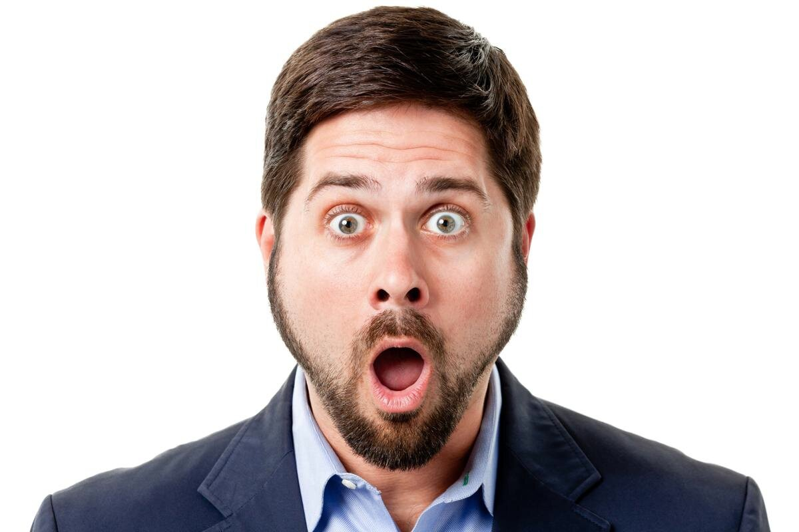

<em>Изображение удивленного мужчины</em>

В отличие от переноса стиля, перенос эмоций подразумевает измненение черт лица, мимика, положения глаз и т.д., т.е. сохраняется свет, окружение и т.п. Такого эффекта можно добиться, выбрав, например, элементы 3-10 латентных векторов изображений при интерполяции, и коэффициент psi=0.5. Полученные изображения представлены далее в табличном формате, результат переноса также крайне выделяется (порой даже слишком).

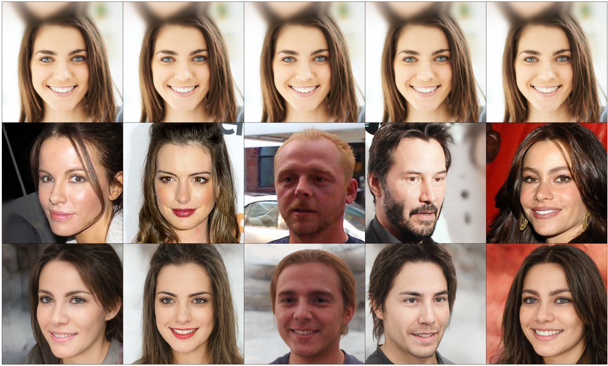

<em>Перенос улыбки</em>

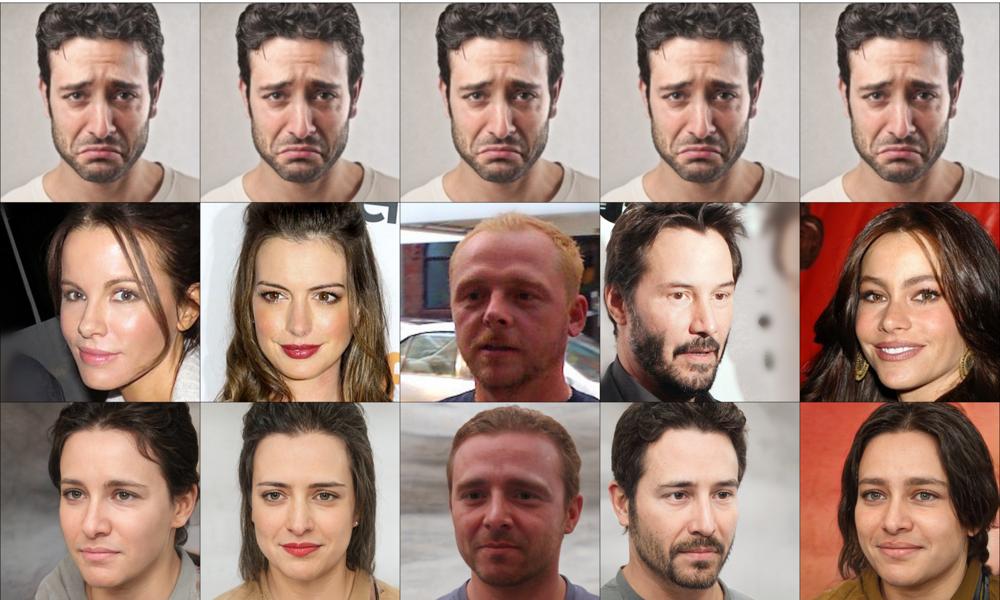

<em>Перенос грусти</em>

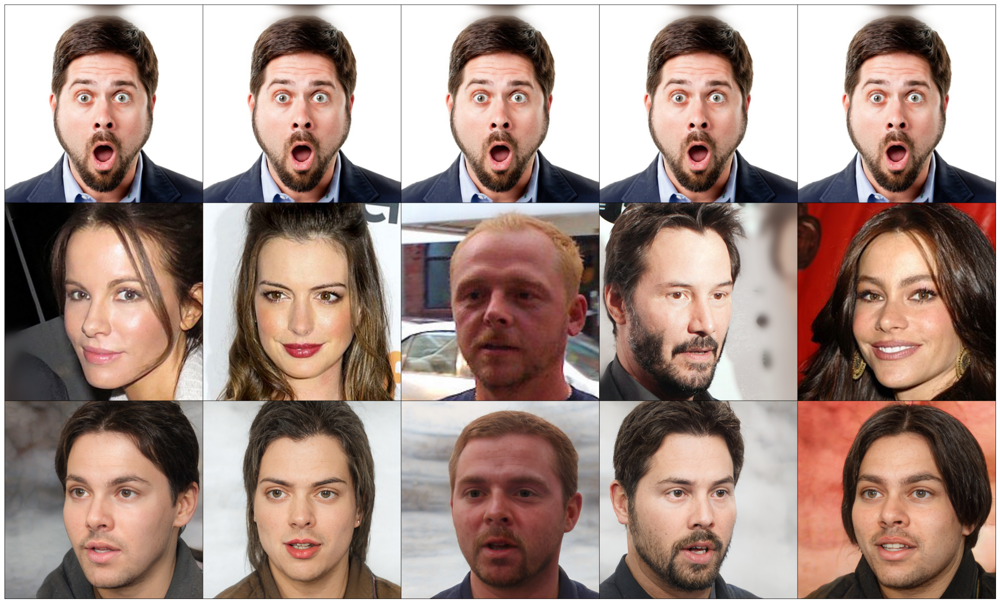

<em>Перенос удивления</em> 


## Перенос лица (Face swap)

Перенос лица из одной фотографии на другую возможно совершить во время поиска вектора в пространстве, если использовать в общей сумме лоссов значение Arcface Loss. Дання функция потерь использует сеть `ms1mv3_arcface_r50_fp16` для вычисления косинусного расстояния между двумя изображениями (в нашем случае генериуремым и тем, с которого переносится лицо), что позволяет сделать свап. Далее представлена табличка переносов лиц "каждый-с-каждым", где по диагонали расположено оригинальное фото актера, а остальные изображения являются соединениями. Отдельные перенесенные черты лиц явно прослеживаются на сгенерированных фото. В данном случае опять же использовалась "оптимизация" вектора E4E со следующими параметрами:
```
regularize_noise_weight = 5e5
rec_weight = 0.5
lpips_weight = 1.0
arcface_weight = 1.5

num_steps = 100
learning_rate = 0.01
```

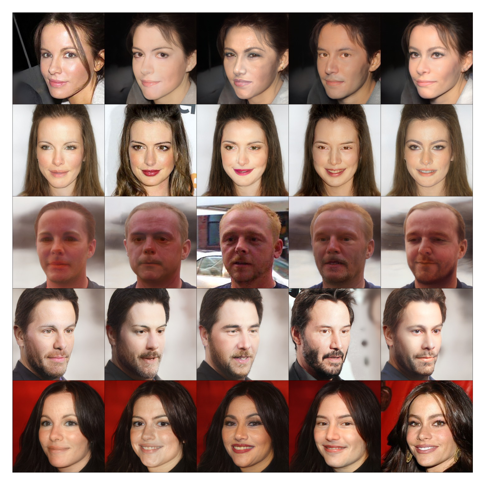

<em>Таблица Face swap</em> 


## Выводы 
На основании проведенных экспериментов по использованию генеративной модели Stylegan2 для различных задач, можно сделать вывод, что энкодер E4E эффективнее отображает изображения в латентном пространстве по сравнению с традиционными методами "оптимизации" векторов с шумом. Однако, дополнительная оптимизация векторов, полученных из E4E, не всегда приводит к улучшению качества изображений, а иногда даже упрощает изображения, снижая детализацию.

Кроме того, эксперименты по переносу стиля и мимики подтверждают возможность сохранения черт лица при изменении стиля или выражения, что может быть полезным в различных случаях.