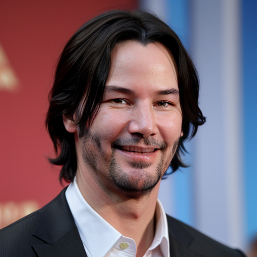
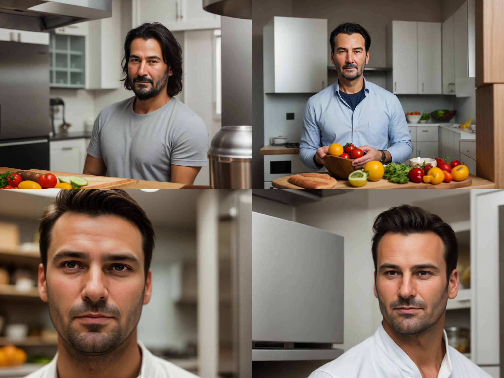
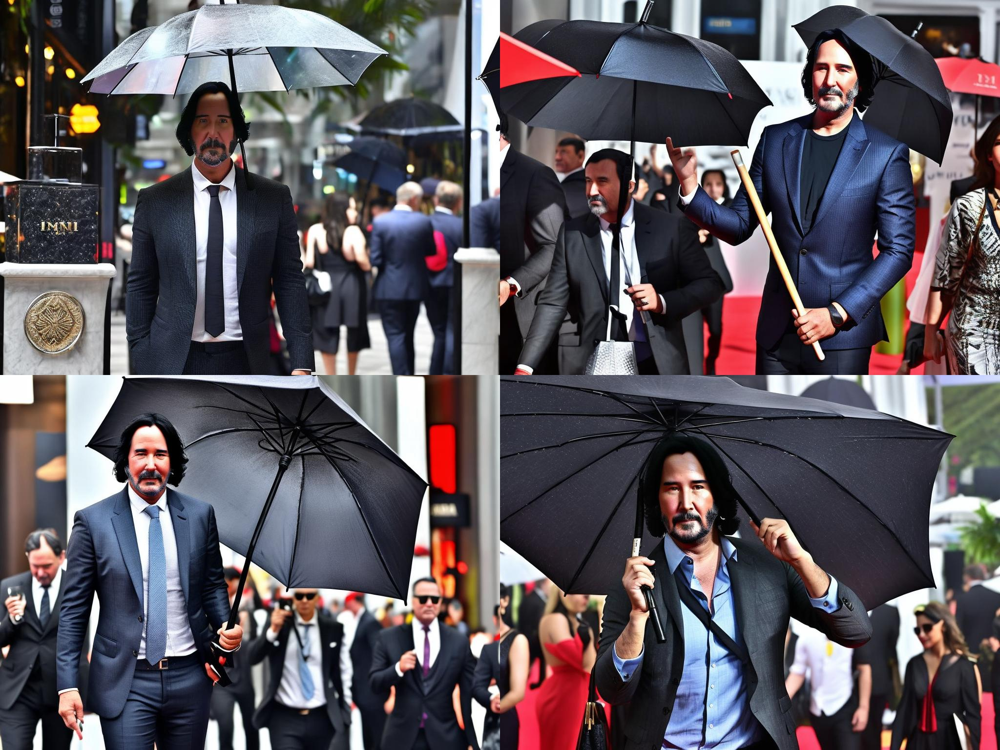

# itmo_gan_course

В этой ветке содержится решение 4-ого ДЗ по Глубоким Генеративным моделям. Задача заключается в дообучении StableDiffusion1.5 на генерацию лица одного конректного человека; обучении LoRA адаптера для этой же сети и последующем сравнении результатов. Кроме этого, необходимо использовать модель ControlNet для контролируемого изменения генерируемого изображения.

Все использованные библиотеки указаны в requirements.txt. Файл DreamBooth_Stable_Diffusion.ipynb содержит исходный код решения ДЗ с комментариями.

Author: Вязников Павел Андреевич

## Данные

В качестве набора данных для дообучения выступает собранный вручную набор из 15-ти фотографий Киану Ривза (`reeves_cropped`). На каждом снимке актер стоит в разной позе, на разном расстоянии от камеры, имеет разное выражение лица и т.д., что поможет модели генерировать более разнообразные фото. Каждое изображение было обрезано до разрешения 512х512.

<p>


</p>
<p>


</p>
<em>Примеры обучающих фотографий</em>


## Тестовые промпты

Для правильного тестирования моделей, помимо закрепленного seed, необходимо заранее определить несколько разнообразных промптов, изображения по которым дадут понимание о качестве полученных чекпоинтов. Далее представлены использованные в работе промпты:
- "a photo of a man sks in sunglasses",
- "a photo of a man sks with girlfriend"
- "a photo of a man sks with umbrella"
- "close up portrait of sks man face, in the kitchen, standing, 4K, raw, hrd, hd, high quality, realism, sharp focus",
- "portrait of sks man face, in the forest, standing, 4K, raw, hrd, hd, high quality, realism, sharp focus",
- "portrait of sks man face, on the street, lights, midnight, NY, standing, 4K, raw, hrd, hd, high quality, realism, sharp 

Первые три промпта достаточно просты и отличаются только близким окружением (наличие солнечных очков, второй человек, зонт), они дадут представление, насколько модель сохранила способность генерировать дополнительные визуальные образы.

Вторая же тройка не добавляет окружения, а наоборот - старается получить как можно более качественное лицо в разнообразных локациях, используя "4K, raw, hrd" и т.д. Эти промпты дадут понимание о качестве генерации самого Киану Ривза.

Для всех промптов выбран единственный негатив - "naked, nsfw, deformed, distorted, disfigured, poorly drawn, bad anatomy, extra limb, missing limb, floating limbs, mutated hands disconnected limbs, mutation, ugly, blurry, amputation".

Для всех экспериментов изображения генерировались в разрешении 768x1024, guidance_scale = 7.5, num_inference_steps = 35.


## Перед обучением

После конвертации базовой модели в формат diffusers, проверим ее изначальные знания на промпте "photo of keanu reeves, random head angle, random smile, wrinkles". Полученный результат не вполне соответствует действительности:
<p>



</p>
<em>Киану Ривз в представлении базовой модели</em>

Проверим модель также на определенных изначально промптах (слева направо в определенном изначально порядке):
<p>


</p>
<em>Киану Ривз в представлении базовой модели (sunglasses, girlfriend, umbrella, kitchen, forest, street)</em>


## Дообучение полной модели

Для дообучения полной модели методом DreamBooth было проведено 2 эксперимента:

### Tiny

Разрешение было понижено до 256 (относительно собранных фото) и отключено обучение текстового энкодера:
```
--instance_prompt="a photo of sks man face" \
--class_prompt="a photo of man, random head angle, random smile" \
--resolution=256 \
--train_batch_size=1 \
--learning_rate=2e-6 \
--lr_scheduler="constant" \
--lr_warmup_steps=0 \
--gradient_accumulation_steps=1 \
--num_class_images=500 \
--max_train_steps=800 \
--checkpointing_steps=800 \
--use_8bit_adam \
```

Результаты модели на закрепленных промптах:
<p>





</p>
<em>Tiny модель (sunglasses, girlfriend, umbrella, kitchen, forest, street)</em>

Такая модель лишь в избранных случаях способна генерировать отдаленно похожие на актера лица.

### Standart

Разрешение было выставлено 512 (как у собранных фото), включено обучение текстового энкодера, а также использована эффективная реализация механизма внимания из xformers:
```
--instance_prompt="a photo of sks man face" \
--class_prompt="a photo of man, random head angle, slight smile" \
--resolution=512 \
--train_batch_size=1 \
--learning_rate=2e-6 \
--lr_scheduler="constant" \
--lr_warmup_steps=0 \
--gradient_accumulation_steps=1 \
--num_class_images=500 \
--max_train_steps=800 \
--checkpointing_steps=800 \
--use_8bit_adam \
--mixed_precision="fp16"\
--train_text_encoder \
--enable_xformers_memory_efficient_attention
```

Результаты модели на закрепленных промптах:
<p>


</p>
<em>Standart модель (sunglasses, girlfriend, umbrella, kitchen, forest, street)</em>

В отличие от tiny, данная модель способна в полной мере передать черты и форму лица Ривза, добавляя при необходимости дополнительные предметы (иногда дублируя самого актера). Несмотря на дообучение, модель сохранила способность генерировать различное окружение и локации.


## Обучение LoRA адаптера

При обучении LoRA адаптеров использовался конфиг, совпадающий со Standart моделью. Было обучено три варианта адаптеров:

### Rank=1
Результаты модели на закрепленных промптах:
<p>


</p>
<em>r1 LoRA модель (sunglasses, girlfriend, umbrella, kitchen, forest, street)</em>

Несмотря на малое значение r, адаптер смог запомнить основные черты лица актера, однако значительно проигрывает в деталях и форме.
Детали: `Steps: 100%|███████████| 800/800 [05:07<00:00,  2.64it/s, loss=0.349, lr=0.0001]`

### Rank=4
Результаты модели на закрепленных промптах:
<p>





</p>
<em>r4 LoRA модель (sunglasses, girlfriend, umbrella, kitchen, forest, street)</em>

Чуть лучшие результаты, чем у r1, однако модель не всегда правильно генерирует лицо, а также в близких кадрах генерация приобрела излишнюю резкость.
Детали: `Steps: 100%|██████████| 800/800 [05:18<00:00,  2.48it/s, loss=0.0273, lr=0.0001]`

### Rank=8
Результаты модели на закрепленных промптах:
<p>


</p>
<em>r4 LoRA модель (sunglasses, girlfriend, umbrella, kitchen, forest, street)</em>

Ожидаемо лучший результат, но полная модель показывает себя лучше как в генерации формы лица, так и оттенков и отдельных черт.
Детали: `Steps: 100%|██████████| 800/800 [05:16<00:00,  2.59it/s, loss=0.0189, lr=0.0001]`


## Использование ControlNet

Используем openpose версию сети ControlNet вместе с 4-мя позициями йоги для генерации новых изображений Ривза.


<em>Используемые для генерации позы йоги</em>

Для каждого изображения будем случайно выбирать позу. Возьмем два варианта обученных моделей для тестирования с ControlNet:

### Standart + ControlNet
Результаты модели на закрепленных промптах:
<p>


</p>
<em>Standart + ControlNet (sunglasses, girlfriend, umbrella, kitchen, forest, street)</em>

Результат получился довольно абстрактным; в попытке нарисовать нужную позу, модель дорисовывает лишние части тела, неестественно растягивает тело и т.д. Наиболее чистые результаты получились на "лесном" промпте.

### LoRA_rank_1 + ControlNet
Результаты модели на закрепленных промптах:
<p>


</p>
<em>LoRA_rank_1 + ControlNet (sunglasses, girlfriend, umbrella, kitchen, forest, street)</em>

Ожидаемо, получаем еще более абстрактные изображения, но по ощущениям лишних частей тела все же стало поменьше :)


## Выводы
На основании проведенных экспериментов по дообучению Stable Diffusion методом DreamBooth на лицо Киану Ривза, можно сделать вывод, что модель при полном дообучении всего на 15 экземплярах (используя совпадающее с таргетными изображениями разрешением) способна крайне хорошо запомнить черты и форму лица, создавая достаточно реалистиные фото. Кроме того, адаптеры, получаемые методом LoRA, также не сильно уступают в качестве, при этом значительно сокращая время обучения (~25min vs ~5min).

Кроме основных экспериментов, также была опробована модель ControlNet для генерации фото с заданной позой человека, однако результаты с ней довольно абстрактны и содержат много ошибок и лишних генераций.
