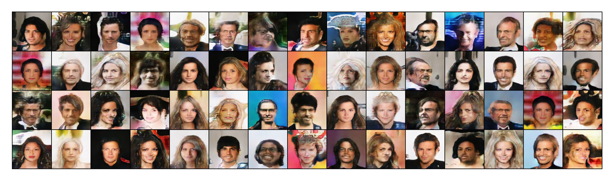

# itmo_gan_course

В этой ветке содержится решение 2-ого ДЗ по Глубоким Генеративным моделям. Задача заключается в реализации и обучении генеративной сети на датасете изображений лиц CelebA с использованием генератора на основе CSPup блоков.

Все использованные библиотеки указаны в `requirements.txt`. Файл `main.ipynb` содержит исходный код решения ДЗ с комментариями.

Author: Вязников Павел Андреевич

## Данные

В качестве обучающей выборки были взяты изображения лиц с [официального сайта датасета CelebA](https://mmlab.ie.cuhk.edu.hk/projects/CelebA.html). Все фото изначально подготовлены авторами (центрированы и приведены к фиксированному размеру 178x218 пикселей), однако в данной работе для достижения наилучших результатов проводится ресайзинг изображений до разрешения 128x128 пикселей (такая размерность выхода у генератора и, соответственно, такая размерность входа у дискриминатора). Кроме того, изображения дополнительно нормализуются до интервала [-1; 1]. Ниже приведен фрагмент загрузчика данных и пример обучающего изображения:

```
def __getitem__(self, idx):
    img = torchvision.io.read_image(self.imgs[idx]) - 127.5
    if self.transform:
        img = self.transform(img)

    return img / 127.5
```


<em>Одно изображение из CelebA</em>

## Реализация моделей

### Генераторы

Одним из требований данного ДЗ является реализация генератора на основе CSPup блоков. Данная архитектура подразумевает наличие несколько последовательных модулей CSP. Генератор в версии бейзлайна принимает на вход вектор латентного пространства размерностью 100, пропускает его через 5 блоков CSP, и затем при помощи обратной свёртки сводит к нужному кол-ву каналов (3=RGB в нашем случае). Архитектуры блока CSP и полного генератора представлены ниже:


<em>Архитектура одного блока CSPup</em>


<em>Архитектура полного генератора</em>

В данной работе CSP был реализован с некоторыми модификациями относительно бейзлайна:
1) В блоки свёрток (вторая половина каналов) был добавлен BatchNorm для регуляризации;
2) ReLu был везде заменен на Tanh;
3) (опционально) Для первой половины каналов был добавлен BatchNorm для регуляризации.

Кроме генератора на основе CSP также в экспериментах был использован вариант из DCGAN, представленный в качестве демонстрации к данному ДЗ. 

### Дискриминатор

В качестве дискриминатора во всех экспериментах использовалось решение из DCGAN, представленное в качестве демонстрации к данному ДЗ. Ниже приведен фрагмент его реализации:
```
self.main = nn.Sequential(
    nn.Conv2d(NC, NDF, 4, 2, 1, bias=False),
    nn.LeakyReLU(0.2, inplace=True),

    nn.Conv2d(NDF, NDF * 2, 4, 2, 1, bias=False),
    nn.LeakyReLU(0.2, inplace=True),

    nn.Conv2d(NDF * 2, NDF * 4, 4, 2, 1, bias=False),
    nn.BatchNorm2d(NDF * 4),
    nn.LeakyReLU(0.2, inplace=True),

    nn.Conv2d(NDF * 4, NDF * 8, 4, 2, 1, bias=False),
    nn.BatchNorm2d(NDF * 8),
    nn.LeakyReLU(0.2, inplace=True),

    # disable this if you work with 64hw images
    nn.Conv2d(NDF * 8, NDF * 16, 4, 2, 1, bias=False),
    nn.BatchNorm2d(NDF * 16),
    nn.LeakyReLU(0.2, inplace=True),

    # swap this if you work with 64hw images
    nn.Conv2d(NDF * 16, 1, 4, 1, 0, bias=False),
    # nn.Conv2d(NDF * 8, 1, 4, 1, 0, bias=False), 
    nn.Sigmoid(),
)
```

## Эксперименты

В рамках работы проведено несколько экспериментов по обучению разных вариантов генератора с различными гиперпараметрами, для каждого выбраны следующие гиперпараметры:
- NDF (размер карты признаков генератора) = 128 (за исключением DCGAN, для него 64);
- NC (кол-во каналов) = 3 (RGB);
- NZ (размерность вектора латентного пространства) = 100;
- Batch_size = 256;
- Opt = Adam.

Обозначения DLR и GLR обозначают значение learning rate для дискриминатора и генератора соответственно. Значения лоссов представлены на изображениях.

Далее приведено описание основных экспериментов:

**1)** В качестве бейзлайна была выбрана модель с указанными изменениями (кроме пункта 3) в генераторе и **DLR = GLR = 1e-4**. Модель обучалась на протяжении 30-ти эпох, при этом **сходимость не была достигнута** (скорее наоборот), и генерируемые изображения стали часто повторяться. Подобные результаты, вероятнее всего, получились из-за использования одинакового lr для генератора и дискриминатора, вследствие чего генератор переобучился и начал выдавать несколько самых "простых" лиц;
   

   <em>График значений лосс функции генератора (синий) и дискриминатора (красный)</em>


   

   <em>Примеры изображений, генерируемых бейзлайном</em>

**2)** Еще одна попытка обучить подобную сеть, но **с пониженным lr = 1e-5. Сходимость также не достигнута**, однако **изображения не столь часто повторяются**;

   

   <em>График значений лосс функции генератора (синий) и дискриминатора (красный)</em>


   

   <em>Примеры изображений, генерируемых моделью, обученной на пониженном lr</em>

**3)** Модифицированная сеть, включающая **3 пункт модификаций** (Для первой половины каналов был добавлен BatchNorm для регуляризации), **GLR = 2e-4, DLR = 2e-3** (генератор обучается медленнее дискриминатора). Модель обучалась 25 эпох, **результаты очень близки к сходимости**, однако, несмотря на довольно хорошее качество, **получаемые изображения также часто повторяются**;

   

   <em>График значений лосс функции генератора (синий) и дискриминатора (красный)</em>


   

   <em>Примеры изображений, генерируемых модифицированной моделью</em>

**4)** Базовая сеть, **GLR = 2e-4, DLR = 2e-5** (генератор обучается быстрее дискриминатора). Модель обучалась 20 эпох, **сходимость достигнута!**. Генератор выдает (относительно) качественные и разнообразные лица. Вывод - главным фактором успеха является разная скорость обучения генератора (выше) и дискриминатора (ниже);

   

   <em>График значений лосс функции генератора (синий) и дискриминатора (красный)</em>


   

   <em>Примеры изображений, генерируемых лучшей моделью</em>

**5)** БОНУС: DCGAN. **DLR = GLR = 1e-4**. Сходимость достигается очень быстро; модель обучалась на протяжении 5 эпох, получая на выходе неплохие разнообразные изображения. Для этого эксперимента не проводилась нормализация изображений в интервал [-1; 1], однако результаты от этого не ухудшились.

   

   <em>График значений лосс функции DC генератора (синий) и дискриминатора (красный)</em>


   

   <em>Примеры изображений, генерируемых DCGAN</em>


## Выводы

В данном ДЗ была решена задача генерации лиц при помощи генеративных нейронных сетей на основе CSPup блоков. Были реализованы модели генератора и дискриминатора, а также проведено множество экспериментов по их обучению на датасете CelebA, на основании которых можно сделать следующие выводы:

1) Использование функции активации Tanh и BatchNorm в CSP значительно улучшает сходимость;
2) Использование различных значений lr, а также beta1=0.5 для оптимизаторов генератора и дискриминатора значительно улучшает сходимость;
3) Нормализация изображений в интервал [-1; 1] не обязательна;